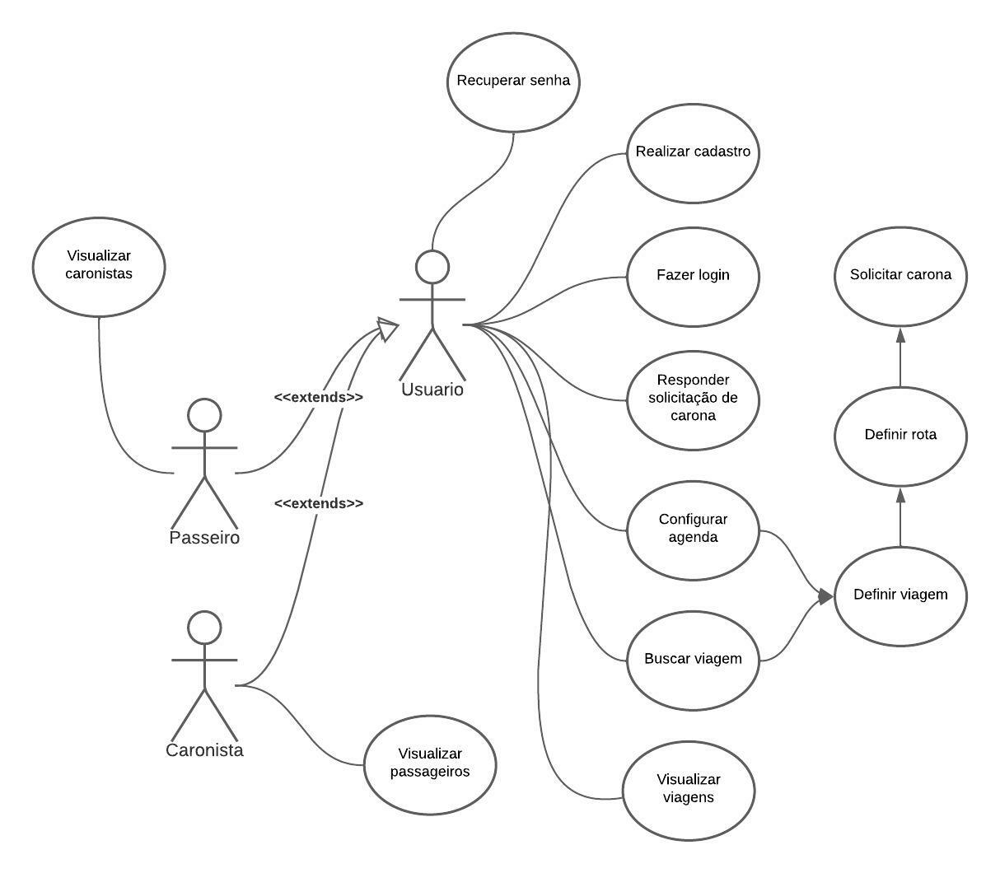

# Caso de uso

# Cenários

## Cenário #01

### **Usuário realiza cadastro com e-mail acadêmico válido**

DADO QUE o usuário deseja se cadastrar no sistema 
QUANDO ele inserir o \<email> e \<senha> 
E confirmar o \<codigo> 
ENTÃO o cadastro será realizado, o usuário será redirecionado para a página de configurar agenda e exibirá uma \<mensagem> 

### **Exemplo**
email: gustavo.ribeiro@discente.ufg.br 
senha: 12345678 
codigo: 123456 
mensagem: Cadastro realizado com sucesso 

---
## Cenário #02

### **Usuário realiza cadastro com e-mail não acadêmico**

DADO QUE o usuário deseja se cadastrar no sistema 
QUANDO ele inserir o \<email> e \<senha> 
ENTÃO o cadastro não será realizado e aparecerá uma \<mensagem> 

### **Exemplo**
email: mail.gustavo.oliveira@gmail.com 
senha: 12345678 
mensagem: Cadastro não realizado, informe um e-mail acadêmico 

---
## Cenário #03

### **Usuário realiza cadastro com e-mail acadêmico inválido**

DADO QUE o usuário deseja se cadastrar no sistema 
QUANDO ele inserir o \<email> e \<senha> 
E informar o \<código> de confirmação 
ENTÃO o cadastro não será realizado e aparecerá uma \<mensagem> 

### **Exemplo**
email: mail.gustavo.oliveira@gmail.com 
senha: 12345678 
codigo: 2 
mensagem: Cadastro não realizado, código de confirmação inválido 

---
## Cenário #04

### **Usuário realiza login com dados inexistentes no sistema**

DADO QUE o usuário deseja realizar login no sistema 
QUANDO ele informar \<email> e \<senha> 
ENTÃO o sistema não realizará o login e exibirá uma \<mensagem> 

### **Exemplo**
email: gustavo.ribeiro@discente.ufg.br 
senha: 12345678 
mensagem: Usuário não encontrado 

---
## Cenário #05

### **Usuário realiza login com dados válidos**

DADO QUE o usuário deseja realizar login no sistema 
QUANDO ele informar \<email> e \<senha> 
ENTÃO o sistema será redirecionado para a página de eventos 

### **Exemplo**
email: gustavo.ribeiro@discente.ufg.br 
senha: 12345678 

---
## Cenário #06

### **Passageiro busca por caronas**

DADO QUE um passageiro deseja buscar uma carona 
QUANDO ele informar o \<endereço de partida> e \<horario de partida> e o \<destino> e \<horario de chegada> 
E confirmar a rota que aparecerá 
ENTÃO o sistema irá listar as caronas disponíveis para a rota e no horário desejado 

### **Exemplo**
endereço de partida: Rua Elvado Lodi, nº 100 
horario de partida: 10:00 
destino: Restaurante Universitário Samambaia 
horario de chegada: 12:00 

---
## Cenário #07

### **Passageiro seleciona uma carona**

DADO QUE o passageiro realizou uma busca por caronas 
QUANDO ele selecionar um dos resultado 
ENTÃO o sistema irá exibir os detalhes daquel carona 

---
## Cenário #08

### **Passageiro envia a solicitação de carona**

DADO QUE o passageiro visualizou os detalhes de uma carona 
QUANDO ele clicar em "solicitar carona" 
ENTÃO o sistema irá enviar uma notificação para o caronista e exibirá uma \<mensagem> 

### **Exemplo**
mensagem: Solicitação de carona enviada com sucesso 

---
## Cenário #09

### **Usuário configura um dia da agenda**

DADO QUE um usuário esteja na página da agenda e deseja configurar um dia 
QUANDO ele informar o \<endereço de partida> e \<horario de partida> e o \<destino> e \<horario de chegada> 
E confirmar a rota que aparecerá 
ENTÃO o sistema irá salvar a configuração para ser usada automaticamente em outras situações e exibirá uma \<mensagem> 

### **Exemplo**
endereço de partida: Rua Elvado Lodi, nº 100 
horario de partida: 10:00 
destino: Restaurante Universitário Samambaia 
horario de chegada: 12:00 
mensagem: Configuração salva com sucesso 
